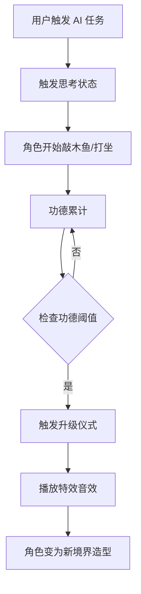

# Clawd-on-Desk 功德修行桌宠 — 产品需求文档

> **⚠️ DEPRECATED / 历史文档（勿当现行规范）**
>
> - **状态**：已废弃作为「当前真相」。保留仅作产品演进考古与早期意图参考。
> - **原因**：文内「2 境界 / 阈值 1000 / 纯程序 SVG」等 MVP 描述已被现行 **6 境界
>   （`0 / 5 / 50 / 150 / 300 / 500`）+ AI 生图流水线** 取代。
> - **现行文档（请改读这些）**：
>   - 素材硬标准：[`../guides/cultivator-asset-standard.md`](../guides/cultivator-asset-standard.md)
>     （画布 / 尺寸 / 阶段矩阵 / 验收容差 / 对外规范）
>   - 生图操作：[`../guides/cultivator-asset-pipeline.md`](../guides/cultivator-asset-pipeline.md)
>   - 经验复盘：[`../guides/cultivator-asset-lessons.md`](../guides/cultivator-asset-lessons.md)
>   - 运行时真相：`themes/cultivator/theme.json` + `assets/source/cultivator/manifest.json`
>     + `src/theme-progression.js` / `src/merit-engine*.js`
> - **仍可参考的段落**（概念层，数值以现行文档为准）：产品定位、用户场景、文化风险。
> - **必须忽略的段落**：§4 境界阈值表、§5 动画/资源命名、§10–12 任务拆分与资源估算、
>   文首「MVP 落地 = 2 境界」对照表。
>
> 来源：`Clawd-on-Desk 功德修行桌宠 产品需求文档.pdf`（整理入库）
> 原标注状态（已过期）：MVP 已按审查修订计划落地（工程 Alpha → 产品 Beta）

## MVP 实现说明（与原始 PRD 的差异）— ⚠️ 历史快照，已过期

> 下表描述的是**早期审查修订后的 MVP 快照**，不是当前仓库状态。
> 当前已扩到 6 境界 + AI 素材流水线；权威数值见
> [`cultivator-asset-standard.md`](../guides/cultivator-asset-standard.md) §4 / §10。

| 原始 PRD | 早期 MVP 落地（历史） | **当前仓库（2026-07）** |
|---|---|---|
| 6 境界完整养成线 | 曾收窄为 **2 境界**（凡人→修行者，阈值 1000） | **6 境界**已落地：`0/5/50/150/300/500` |
| OpenAI / APNG / GIF 精修素材 | 曾用确定性程序 SVG | **AI 生图 → 切分 → SVG+CSS**；attention/error/sleeping 仍程序生成 |
| 独立功德 HUD 窗口 | 内嵌 pet renderer overlay | 仍内嵌 overlay（未改） |
| `themeVariant` 表达境界 | builtin-only progression overlay | 仍 builtin-only（未改） |
| 展示态计分 | session snapshot fanout | 仍 snapshot fanout（未改） |
| 每秒写盘 | ≤30s 防抖 flush | 仍防抖 flush（未改） |
| 外部主题养成 API | 仅内置 `cultivator` | 仍仅内置（未改） |

持久化字段（仍有效）：`prefs.meritProgress[themeId]`（merit / dayKey / dailyEarned / lastActiveDayKey / streakDays / introSeen）与 `prefs.meritOverlayEnabled`。`stageIndex` 不落盘，始终由 `resolveStage(merit, stages)` 派生。

---

## 执行摘要

本文档在 Clawd-on-Desk 项目基础上提出「功德修行桌宠」系统，将 AI 助手的工作状态可视化为角色修行过程。AI 在思考、运行、完成任务时，桌宠会「敲木鱼」「打坐」「念经」等积累功德；当功德达到阶段阈值时，角色自动升级境界（如凡人 → 修行者 → 小和尚 → 罗汉 → 菩萨 → 佛祖）。核心目标是打造「随着用户使用时间增长不断进化的 AI 伙伴」。系统需包含完整的功德算法、阶段定义、动画资源规范、UI/UX 设计、数据模型、开发任务拆分和验收方案。

Clawd-on-Desk 是一个像素风开源桌面宠物，它能实时感知 Claude Code、Cursor、Codex 等 14+ 种编程助手的运行状态（如思考、打字、构建、报错等），并通过动画直观展示这些状态。我们将以此为基础，在 Clawd 的事件驱动 + 状态机架构中，加入「功德积累 → 境界升级」的养成玩法，使用户在使用 AI 编程助手时获得陪伴和成长感。以下需求定义了产品定位、用户场景、功德系统细节、角色阶段和动画规范、数据和接口设计，以及开发任务和验收标准。

---

## 1. 产品定位与目标用户

### 产品定位

「功德修行桌宠」是一款将 AI 助手的计算过程具象化为佛系养成的桌面宠物应用。它利用用户与 AI 交互的空闲时间（例如 AI 模型在后台思考/生成的时刻）来让桌宠「修行敲木鱼」，积累功德并不断提升境界，给长期使用者带来「陪伴、成长」的体验。

### 目标用户

- 对佛教文化或东方文化有兴趣的用户，希望拥有精神/哲学层面的特色体验者
- AI 工具使用者（如程序员、研究者）日常使用 AI 编程助手，对长期陪伴有需求
- 追求长期积极反馈、喜欢养成和成长机制的用户

### 差异化

与一般的桌宠（仅卖萌或简单互动）不同，本桌宠强调长期价值：伴随用户使用 AI 工具过程中不断成长；设计了功德值、境界、升级仪式等概念，使日常使用成为角色修行的一部分，提高留存。Clawd-on-Desk 原有状态反馈功能为我们提供了事件捕捉和动画基础，我们在此基础上拓展养成系统。

---

## 2. 核心体验场景

以下为预期的用户体验流程，按照使用阶段划分。

### 2.1 初次使用体验

- **启动应用**：用户安装并首次运行桌宠后，会看到一个基础修行者形象（凡人或初级修士造型）。人物穿着简单僧衣，席地坐于蒲团前，面前有木鱼。
- **欢迎与引导**：桌宠出场时播放简短提示动画（如合十礼），提示「开始修行吧」之类文案。引导用户输入 AI 任务，让桌宠加入「修行」过程。
- **角色状态**：初始状态下，角色「打坐」或「看屏幕」，偶尔眨眼。此时屏幕或对话框角落显示功德值（初始为 0）和阶段名称（「凡人」）。
- **用户印象**：「这小桌宠好有意思，像在修行一样陪我。」用户第一次使用时，应能立即感受到佛系修行氛围。

### 2.2 日常使用体验

- **AI 计算触发修行**：每当用户在 Claude Code/Cursor 等 AI 工具中发起任务（如生成代码、查询等），会有状态事件传到桌宠（例如触发 thinking 状态）。此时桌宠进入修行模式：抬头合掌、敲木鱼或念经，随之播放木鱼声或低沉梵音占位。
- **功德积累**：桌面固定显示实时功德数值和小进度条。每秒钟思考即获得少量功德（见设计章节），任务完成后获得额外功德。桌宠在任务完成时做出相应反应，例如笑意欣然或双手合十祝贺。
- **日常行为**：在 AI 工作间隙，桌宠执行生活化行为：喝水、伸懒腰、打坐冥想、望窗等，增加活泼度。它可能主动清理桌面、整理僧衣等，体现「修行日常」。
- **反馈提示**：功德值累积、阶段变化时，通过小弹窗/提示音/特效让用户察觉。例如工作中获得功德后，数字会闪动或飘出金光粒子，达到升级条件时出现「境界突破！」提示。

### 2.3 升级时刻体验

- **升级触发**：当累计功德值达到某阶段阈值时，进入升级流程。此时屏幕弹出全屏或靠边动画：佛光绽放、祥云环绕，并播放庄严的铃声或经声占位音效。
- **仪式流程**：桌宠逐渐从基础状态变形（如从跪坐状态渐变到站立、双手合十、金光全身），同时新的背景元素（如莲台、佛珠）缓慢显现。完成后，屏幕中显示「恭喜！晋升为 [新境界名]」之类提示。
- **用户感受**：升级仪式要让用户感觉庄严而神圣，类似游戏中「升星进化」那样给人惊喜和满足感。需注意避免过度商业化，与佛教文化风格相符。

### 2.4 长期留存体验

- **阶段增多**：随着使用天数和任务数量增加，桌宠不断解锁新阶段。每个新阶段都有显著外观和行为差异，让用户能够感知到「它真的变了」。
- **成就感**：桌宠的成长与用户使用时间绑定，当角色达到高级境界时，用户会产生「这是我的专属伙伴」的认同感。「我辛苦积累的功德让它成为佛祖了」成为乐趣驱动。
- **可选元素**：在后续版本，可加入排行榜、每日功课等社交/游戏元素，增强粘性。例如每日登录奖励功德、连续使用 7 天额外功德、成就徽章等。

---

## 3. 功德系统设计

功德系统将所有与 AI 交互的事件映射为「修行功德」增量。包括功德来源、增量规则、冷却和奖励等。

### 3.1 功德来源事件映射

系统主要监听 Clawd-on-Desk 的状态变化事件（来源于 AI 编程助手的钩子）。关键事件包括（示例）：

| 事件 | 描述 | 效果 |
|------|------|------|
| UserPromptSubmit / SessionStart | 用户发起新问题/任务 | 角色开始「准备修行」（起身或合十姿态）。暂不直接增加功德，但可视为进入思考准备阶段 |
| Thinking / PreToolUse | AI 模型在后台计算、分析或运行代码 | 角色进入敲木鱼或打坐模式，开始按秒累计功德。可视为持续输入功德 |
| Stop / PostToolUse | AI 成功完成任务或运行结束 | 角色庆祝/合十，获得一大笔功德奖励 |
| PostToolUseFailure / Error | AI 执行失败或报错 | 角色表现思考/懊恼，但可获得少量功德（修行在挫折中） |
| SessionEnd | 一次 AI 会话或任务彻底结束 | 可视为小结，总结功德 |

### 3.2 功德增量规则

**思考阶段（每秒）**：角色在思考/运行状态下，每秒获得基本功德值。设默认值 `meritPerSec = 1`。此值可在配置中调整。

**任务完成**：每完成一次任务，角色获得固定功德奖励（如 `completionMerit = 50`）。如果任务复杂度高（例如大规模代码生成），可乘以一个系数（如 `complexityFactor > 1`）进行加成。

**运行出错**：每发生一次失败，角色获得少量功德（如 `errorMerit = 5`）以鼓励修行面对挫折。多次快速错误可有冷却机制。

**冷却与上限**：

- **速率上限**：思考状态累计功德时，每秒最高可获得 `maxMeritPerSec`（默认 5 分）以防止误用。
- **事件冷却**：对于频繁触发的事件（如连续短任务完成），设置最小冷却时间（如 1 秒）以避免爆发式积累。
- **每日奖励**：每天首次使用奖励额外功德（如 `dailyBonus = 100`），鼓励连续登录。
- **连续登录**：连续使用达到一定天数（如 7 天），奖励额外功德（如 `streakBonus = 500`），并可解锁特别称号或资源。

**异常情况**：

- 如果任务突然中断或 AI 崩溃，角色进入闭目冥想（修行中断）状态，并给予小量功德以示「因祸得福」。
- 如果长时间无 AI 交互（如系统空闲超过 1 分钟），角色自动进入睡眠（不再积累功德），以节省资源并等候下一次交互。

### 3.3 可调参数表

| 参数 | 默认值 | 描述 |
|------|--------|------|
| `meritPerSec` | 1 | AI 思考/运行状态时每秒积累的基本功德 |
| `completionMerit` | 50 | 一次任务成功完成获得的基础功德奖励 |
| `errorMerit` | 5 | AI 任务失败时获得的功德 |
| `maxMeritPerSec` | 5 | 思考状态下每秒功德上限，防止短时间爆发积累 |
| `minEventCooldown` | 1s | 同一事件（如任务完成）之间的最小冷却时间 |
| `dailyBonus` | 100 | 每日首次启动或使用时的功德奖励 |
| `streakDays` | 7 | 连续使用天数阈值，触发额外奖励 |
| `streakBonus` | 500 | 连续使用 `streakDays` 天后一次性奖励功德 |
| `mantissaSmoothing` | true | 是否对高频事件的功德进行平滑处理，避免激增 |
| `overflowProtection` | true | 是否限制当日累计功德，防止过度累积（如每日上限 10000） |

所有参数均可在配置中调整。默认值是基于一般使用场景估算，实际可根据用户使用情况做迭代优化。

---

## 4. 境界（阶段）定义

> ⚠️ **本节阈值表已废弃。** 现行 6 境界与功德阈值见
> [`cultivator-asset-standard.md`](../guides/cultivator-asset-standard.md) §4
> （`0 / 5 / 50 / 150 / 300 / 500`）。以下原文仅作早期产品设想存档。

角色成长分为若干境界，每达到一个功德阈值即突破境界。以下为至少 6 级的示例设计：

| 阶段 | 功德阈值 | 外观与行为变化 | 解锁资源/装扮 | 升级仪式（特效/音效） |
|------|----------|----------------|---------------|----------------------|
| 凡人 | 0 – 999 | 基础僧服，木鱼、蒲团。行为：敲木鱼、打坐 | 木鱼、蒲团（初始） | 木鱼声、淡淡金光提醒（小功德提示） |
| 修行者 | 1,000 – 4,999 | 穿着僧衣，佛珠、香炉出现。行为：念经、冥想 | 新增：香炉、佛珠挂饰 | 金光特效增强，念经音效（占位） |
| 小和尚 | 5,000 – 49,999 | 升起莲花座，打坐双手合十。行为：闭目冥想、合十 | 新增：莲花垫、烛台、铃铛 | 佛光环绕，钟磬声（占位音效） |
| 罗汉 | 50,000 – 499,999 | 金色僧袍，身披袈裟。行为：站立参禅、普度 | 新增：袈裟、金身光晕、祥云背景 | 流光特效，诵经或鼓声（占位音效） |
| 菩萨 | 500,000 – 4,999,999 | 身披宝相天衣，背后莲花造型光环。行为：慈悲祝福、点化 | 新增：宝相天衣、莲花座和众多祥云 | 烁金光芒，和缓梵乐（占位） |
| 佛祖 | ≥ 5,000,000 | 坐莲台，光环万丈、佛光普照。行为：讲法、入定 | 全部资源。专属场景：极乐净土背景、飞舞花瓣 | 万佛朝圣特效，庄严法号音（占位） |

**外观/行为变化**：每个阶段除了角色自身服饰变化，还会改变场景和周围物件（如蒲团 → 莲花座、普通屏风 → 祥云佛像等），使境界差异明显。

**解锁资源/装扮**：阶段提升会解锁新资源，如佛珠、袈裟、莲台等，供美术团队制作。

**仪式感**：在升阶时添加仪式效果，比如「佛光万丈」「祥云升腾」等，并配以庄严的提示或音效。音效可以先用占位音（鼓声、梵呗等），后续可替换专业音轨。

> **提示**：阈值与增量规则可根据测试反馈调整，以上数值仅为示例。阶段名称和仪式内容应尊重文化，以庄重严肃的态度设计（详见风险章节）。

---

## 5. 行为与动画规范

> ⚠️ **本节动画/资源组织规范已废弃。** 现行硬标准（画布、6 帧敲击、FX 分层、命名、验收）见
> [`cultivator-asset-standard.md`](../guides/cultivator-asset-standard.md) 与
> [`cultivator-asset-pipeline.md`](../guides/cultivator-asset-pipeline.md)。
> 以下「characters/stage-N/animations/…」目录设想**从未落地**；现行是
> `assets/source/cultivator/generated/{stage}-{action}.png` → `themes/cultivator/assets/*.svg`。

### 5.1 行为分类

角色行为按作用分类并对应动画。主要类别示例：

| 行为 | 描述 |
|------|------|
| 思考/敲木鱼（Knock） | 角色坐姿端正，双手举木槌敲击木鱼 |
| 打坐冥想（Meditate） | 角色盘腿打坐，双手合十或打坐姿势，闭目冥想 |
| 念经/诵经（Chant） | 角色手持经书或做持珠礼，低头念经 |
| 休息/日常（Idle/Rest） | 角色喝水、伸懒腰、观察屏幕、闭目养神等 |
| 庆祝/祝福（Celebrate） | 角色站立喜悦、合掌、或双手合十祝福 |
| 祈愿/施法（Bless） | 高级阶段独有，角色双手合十或作佛法印，念佛祝愿 |

### 5.2 动画设计要点

**帧数 & FPS**：建议每个动作 20–30 帧（2–3 秒循环），FPS 保持 12–15。快速动作（如敲击）可适当提高 FPS 到 15–20；静态冥想动作可低到 8 FPS。

**循环 vs 一次性**：

- 日常 Idle、思考木鱼、打坐等应循环播放，表现持续性。
- 念经片段、庆祝动作等可以设计为一次性动画，播放完成后回归到循环状态（或 Idle）。

**过渡规则**：新行为触发时应有简单过渡（如微帧衔接或淡入淡出）。避免突兀切换。例如，Idle 到敲木鱼之间可以通过角色缓慢起身的帧过渡。

**优先级与随机权重**：空闲状态下，角色可以随机执行多种小动作。设定每种行为的权重：如 Idle 正常（权重 70%）、眨眼（20%）、喝水（10%）等。业务状态如「任务完成」时，庆祝行为应拥有最高优先级（100%）。

### 5.3 资源组织与命名示例

资源目录结构应清晰且易扩展，例如：

```text
characters/
  cultivator/           # 角色族/主题名
    stage-1/            # 阶段 1：凡人
      character.json    # 角色元数据（阶段、外观名等）
      animations/
        knock/
          001.png
          002.png
          ...
        meditate/
          001.png
          002.png
          ...
        idle/
          001.png
          002.png
          ...
    stage-2/            # 阶段 2：修行者
      animations/
        knock/
        chant/
        idle/
        ...
```

命名规范：文件夹名称以行为英文关键字标识（如 `knock`、`meditate`）。帧图按顺序编号（`001.png`、`002.png` …）。

**Character 配置示例**（`character.json`）：

```json
{
  "id": "cultivator_stage1",
  "name": "凡人修行者",
  "stage": 1,
  "animations": {
    "idle": "idle",
    "knock": "knock",
    "chant": "chant",
    "celebrate": "celebrate"
  }
}
```

**行为配置示例**：

```json
{
  "knock": {
    "frames": ["knock/001.png", "knock/002.png", "knock/003.png", "knock/004.png"],
    "fps": 12,
    "loop": true
  },
  "chant": {
    "frames": ["chant/001.png", "chant/002.png", "chant/003.png"],
    "fps": 8,
    "loop": false
  },
  "celebrate": {
    "frames": ["celebrate/001.png", "celebrate/002.png", "celebrate/003.png"],
    "fps": 10,
    "loop": false
  }
}
```

业务逻辑根据 `character.json` 加载对应阶段资源，可无代码修改地增添新阶段/角色资源包。

---

## 6. 功德视觉反馈与仪式设计

### 6.1 功德增量视觉反馈

- **小功德**：例如每获得单个功德时，屏幕上方或角色周围弹出微小金光粒子（闪光、莲花瓣等），以及加号数字跳动特效。木鱼敲击时也可同步出现金光溅射效果。
- **大功德**：对于较大一笔功德（如任务完成、连续登录奖励等），施放更显著的特效，例如金色莲花绽放、屏幕闪光、或者扩大粒子效果。
- **提示元素**：屏幕角落应显示累计功德数值和当前阶段名，可动态更新。当功德增加时，数字短暂高亮或放大。进度条（当前功德/下一级阈值）可辅助用户了解距离下次升级还有多少。

### 6.2 境界突破仪式

**流程**：达到阈值触发后，角色停止当前动作，舞台中心展开神圣光芒，角色身后出现祥云、佛光等。播放提示文字「恭喜晋升为 [新境界]！」同时可伴有庄严提示音（例如低沉法号或钟声占位）。

**视觉特效**：使用大范围粒子（金光、花瓣、光轮）突出仪式感。切换至新角色造型时，可渐变淡入新纹理。

**示意流程图**：



> 角色升级后自动继续当前状态，例如有新阶段时仍然根据 AI 事件选择相应行为。

---

## 7. 数据模型与持久化

### 7.1 数据模型（TypeScript 接口示例）

为实现功德系统，需要定义以下核心数据结构：

```typescript
// 用户进度模型
interface Progress {
  characterId: string;  // 当前角色/阶段标识
  stage: number;        // 当前境界等级
  merit: number;        // 累计功德值
}

// 角色/阶段信息
interface Character {
  id: string;
  name: string;
  stage: number;
  animations: { [state: string]: AnimationConfig };  // 动画配置
}

// 动画配置
interface AnimationConfig {
  frames: string[];  // 帧图片路径列表
  fps: number;
  loop: boolean;
}

// 功德事件（用于记录日志或分析）
interface MeritEvent {
  type: 'thinking' | 'success' | 'error' | 'dailyBonus' | 'streakBonus';
  amount: number;
  timestamp: number;
  detail?: string;  // 例如任务描述或错误信息
}

// 阶级配置（从哪个功德值起升到哪个角色）
interface LevelConfig {
  stage: number;
  requiredMerit: number;
  characterId: string;
}
```

### 7.2 持久化方案

- **数据存储**：初期使用浏览器的 `localStorage` 或 `IndexedDB`（借助 Electron 可直接访问本地文件），保存用户的 `Progress` 和设置。简易实现快速可用。
- **未来扩展**：如需管理大量日志或支持多用户，可采用本地 SQLite 或轻量级嵌入式数据库，确保性能与数据安全。
- **数据迁移/备份**：每次应用更新时，检测是否有旧版本数据（如旧 key、旧格式），自动迁移到新结构。提供「导出/导入」功能，以备份功德记录和角色进度（JSON 格式）。

---

## 8. 接入点与事件契约

桌宠需要监听 Clawd-on-Desk 转发的 Agent 事件。以下是建议的事件监听与功德映射示例：

| Clawd 事件 (Agent Hook) | Payload 示例 | 功德映射 |
|-------------------------|--------------|----------|
| SessionStart / UserPromptSubmit | `{ event: "UserPromptSubmit", agent: "ClaudeCode", sessionId: "abc123", prompt: "请写一段代码" }` | 开始思考，角色起身合十（暂不加功德） |
| thinking（持续状态） | `{ event: "thinking", agent: "ClaudeCode", sessionId: "abc123" }` | 进入敲木鱼/打坐模式，每秒 +1 功德 |
| Stop / PostToolUseSuccess | `{ event: "Stop", agent: "CodexCLI", sessionId: "xyz789", result: "完成", files: 3 }` | 任务完成，固定加 +50 功德 |
| PostToolUseFailure | `{ event: "PostToolUseFailure", agent: "Copilot", sessionId: "def456", error: "RuntimeError" }` | 任务出错，加 +5 功德（鼓励修行） |
| SessionEnd | `{ event: "SessionEnd", agent: "ClaudeCode", sessionId: "abc123" }` | 会话结束，检查是否触发连续天数奖励等 |
| Idle（无活动） | `{ event: "Idle", agent: null }` | 长时间闲置，角色打坐/休息（不增功德） |

> **说明**：`event` 依据具体 Clawd 事件命名，上表仅为示例。开发时需对照 Clawd 的实际 Hook 事件列表（可参考 [`docs/guides/state-mapping.md`](../guides/state-mapping.md) 和现有主题动画实现）进行实现。每个事件需提供必要的上下文（如 `agent`、`sessionId` 等），供功德系统使用和记录。

---

## 9. 算法与参数建议

**连续天数加成**：功德可按连续使用天数线性或指数加成。例如第 n 天的基础每日奖励可用公式 `dailyBonus * (1 + 0.1*(n-1))`，10 天后奖励翻倍。

**任务复杂度系数**：根据任务耗时或文件数量，设置 `complexityFactor = 1 + α * (任务规模指数)`，为复杂任务适当加成功德。

**防刷机制**：

- 限制短时间内重复触发的功德（使用冷却时间表）。
- 如果系统检测到机器人行为（如每秒启动新任务），可减少功德增量。
- 保证每日累计功德有上限（可配置，如 10000），防止异常使用。

**示例伪代码**：

```javascript
function onThinking(dt) {
  // dt: 思考状态持续时间（秒）
  let gain = meritPerSec * dt;
  gain = Math.min(gain, maxMeritPerSec * dt);  // 限速
  addMerit(gain);
}

function onTaskComplete(complexityFactor) {
  let gain = completionMerit * complexityFactor;
  if (timeSinceLastCompletion < minEventCooldown) {
    gain *= 0.5;  // 冷却期间成效减半
  }
  addMerit(gain);
}

function checkDailyStreak() {
  if (lastUseDate is yesterday) {
    streakCount += 1;
    addMerit(streakBonus * streakCount);
  } else if (not consecutive) {
    streakCount = 1;
  }
}
```

**调试建议**：初期可记录详细日志，分析实际功德增速，调整参数平衡节奏。

---

## 10. 开发任务拆分与时间估算

按 Sprint 划分任务示例（以 2 周为一个 Sprint 单位）：

### Sprint 1（2 周）

| 任务 | 估算 |
|------|------|
| 功德系统基础：实现 Progress 数据模型、事件监听框架、功德计数逻辑 | 2 人日 |
| 动画与行为引擎：扩展已有 Clawd 状态系统，增加敲木鱼、打坐、念经、庆祝等新动画接口 | 3 人日 |
| 角色资源框架：设计资源目录和 JSON 配置规范，制作阶段 1 所有行为原型帧（简易黑白占位图） | 4 人日（美术+研发共同） |
| 奖励显示 UI：添加功德数字和进度条、弹窗提示，实现小功德飞溅效果 | 2 人日 |
| 集成与测试：联调 AI 事件，模拟思考/完成，验证功德增减正确；预备 Sprint Demo | 2 人日 |

### Sprint 2（2 周）

| 任务 | 估算 |
|------|------|
| 阶段升级流程：实现境界判断与升级逻辑，制作第 1 到第 2 阶段切换动画（过渡效果） | 3 人日 |
| 参数配置：实现配置界面或 JSON，使功德参数可调（每日奖励、阈值、权重等） | 2 人日 |
| 行为随机权重：设计空闲状态下多行为权重与优先级逻辑 | 1 人日 |
| 资源制作：完成阶段 1、2 所有行为的完整帧动画，包含背景元素 | 5 人日（美术） |
| 稳定性与优化：性能测试（确保帧率稳定），错误处理（如断网、Agent 崩溃） | 2 人日 |

### Sprint 3（2 周）

| 任务 | 估算 |
|------|------|
| 更多阶段与行为：增加第 3 阶段资源和动画、角色衍生行为 | 4 人日 |
| 特效与音效：加入粒子特效（小/大功德）、升级时背景特效，添加音效占位 | 3 人日（美术/音效） |
| 数据持久化增强：切换到更可靠的存储，添加备份导入导出功能 | 2 人日 |
| 跨平台兼容：在 macOS/Linux 上测试和修复界面问题，确保外观一致 | 2 人日 |
| QA 与文档：编写单元/集成测试用例，准备验收材料、编写用户文档 | 2 人日 |

**优先级说明**：功德计数和核心动画逻辑为高优先级（P0），阶段流程和 UI 为中（P1），增强特效/拓展后续内容为低（P2）。

### MVP 范围

- 实现一位角色的 2 个阶段（凡人 → 修行者）
- 基本行为：敲木鱼、打坐、简单 idle、庆祝动作
- 功德累计、升级流程可跑通
- 基本 UI 显示功德值和提示

完成这些后可发布内部测试（约 2–4 周开发）。

---

## 11. 验收标准与 QA 测试用例

### 功能验收

- **功德计数**：AI 思考时持续计时加分；每次任务完成/失败按规则加分；连续登录计额外分。验证各种边界（短时任务、高频事件、冷却、阈值边缘）均正确。
- **阶段升级**：当 `merit ≥ 阈值` 时触发升级，界面有全屏或弹窗提示，角色外观切换，进度重置或继续到下一级。
- **行为展示**：角色在不同状态和阶段下都有对应动画：
  - Idle 阶段能随机眨眼/喝水/打坐等
  - AI 运行时切换到敲木鱼/念经/打坐等动画
  - 升级时出现仪式动画
- **UI 元素**：功德数值、进度条、状态标签显示正常且实时更新；升级提示准确弹出；音效特效触发及时（可静音）。
- **配置可用**：可以通过配置修改功德参数、阈值、权重等，无需改代码。

### 性能与稳定

- **帧率**：动画播放在常见分辨率（1080p/4K）均保持平滑（≥ 30fps）。
- **资源加载**：大量图片资源在切换阶段时完成预加载，不出现卡顿或显存泄漏。
- **内存占用**：长时间运行后内存使用稳定，无明显增长。

### 升级流程验证

- 在关键阈值附近累积功德，确认只在首次达到阈值时触发一次升级，不多次触发。
- 升级后保留或正确恢复当前 AI 状态（如继续敲木鱼）。

### 异常情况

- 测试异常关机/重启，应用重启后进度不丢失。
- 当发生错误事件、未知状态或资源缺失时，系统应有默认退路（如回到 Idle 状态），避免崩溃。
- 跨主题（不同角色包）测试，确保资源路径缺失会提示报错而不导致整个应用挂死。

### 跨平台注意

- 在 Windows/macOS/Linux 上测试可执行文件，确认窗口显示和拖拽交互正常，音效可用。
- 特殊权限：如 macOS 隐藏浮窗焦点等应调整，确认不影响核心功能。

---

## 12. 资源清单与产出量估算

> ⚠️ **本节资源估算与「AI 生成素材流程建议」已废弃。** 现行流水线与验收见
> [`cultivator-asset-standard.md`](../guides/cultivator-asset-standard.md) §2 / §6 / §9
> 与 [`cultivator-asset-pipeline.md`](../guides/cultivator-asset-pipeline.md)。

### 图像资源

按阶段和行为统计帧数：

- **每阶段角色动作**：假设每个主要行为约 20–30 帧动画。以三种行为（Idle、敲木鱼、打坐）为例，每阶段约 60–90 张。
- **阶段数**：MVP 实现 2 阶段需 ~180 张；完整 6 级需 ~6×90 = 540 张角色帧图（不含环境）。
- **环境/特效**：升级动画可能额外需要 50–100 张粒子、光效帧；小功德飞溅等特效每个 10–20 张。
- **UI 元素**：进度条、数字跳动等简单图形（可程序生成或少量帧图）。

### 占位音效

准备每种情境音效占位文件（`.wav` / `.mp3`）：

- 敲木鱼声（循环木鱼声）
- 低沉梵音/经文（用于念经背景）
- 提示音效：升级钟声、提示音
- 日常音效：喝水、叩钟

**估算总量**：角色帧图 ~500+，特效帧 ~100，音效文件 5–10，合计资源量适中。

### AI 生成素材流程（建议）

- 可使用 AI 图像生成工具（如 Stable Diffusion）初步设计角色和场景参考图。
- 使用插画工具（或让美术细化）将 AI 结果绘制成像素风或矢量图后拆分帧。
- 特效粒子可尝试使用合成软件导出序列，然后像素化。
- 音效可先用开放素材或 AI 生成示例音频占位，再由专业人员混音优化。

---

## 13. 风险与缓解措施

### 技术风险

| 风险 | 缓解措施 |
|------|----------|
| 资源加载和性能：大量帧图可能导致内存或性能瓶颈 | 动画帧量控制，按需预加载，使用精灵表（SpriteSheet）合并 |
| 集成复杂度：需兼容 Clawd 现有状态机 | 与 Clawd 官方功能隔离，尽量使用其提供的钩子接口，无侵入式修改 |

### 文化敏感性

| 风险 | 缓解措施 |
|------|----------|
| 宗教元素：佛教符号、仪式需尊重，不可恶搞 | 咨询佛学专家，避免使用禁忌形象（如不显示「佛祖像」等具象神像，仅呈现抽象符号）。说明本产品旨在比喻意义，尊重文化 |
| 名称和术语：谨慎使用「佛祖」「菩萨」等词，避免引起争议 | 可考虑替代名称或增加免责声明（娱乐用途） |

### 版权与审美

| 风险 | 缓解措施 |
|------|----------|
| 素材需自行绘制或获得授权，避免盗用寺庙真人素材 | 使用原创或开源素材，确保符合 MIT/LGPL 等许可 |
| 美术风格需统一，避免歧义 | 美术规范详细审校，测试用户反馈 |

### 资源成本

大量高质量角色和特效素材会增加成本和工作量。缓解：初版可使用简化插画（卡通佛像风格），后续分阶段完善；利用 AI 工具辅助初稿，人工重点打磨关键帧。

---

## 总结

本方案在 Clawd-on-Desk 现有架构基础上，新增「功德修行」养成系统，技术可行性高，无需重构核心。实现后可将 Clawd 桌宠转化为「数字佛系伙伴」，通过文化创新吸引用户长期使用。详细设计保证了可交付性和产品体验，后续团队可依据文档拆分任务、开发和测试。

### 相关文档

> 本 PRD 已 **DEPRECATED**。优先阅读：

- [素材标准 Spec](../guides/cultivator-asset-standard.md) ← **现行权威**
- [素材流水线](../guides/cultivator-asset-pipeline.md)
- [素材复盘](../guides/cultivator-asset-lessons.md)
- [状态映射](../guides/state-mapping.md) / [状态映射（中文）](../guides/state-mapping.zh-CN.md)
- [主题、状态与 UI 笔记](theme-state-ui.md)
- [Agent 运行时架构](agent-runtime-architecture.md)
- [主题创作指南](../guides/guide-theme-creation.md)
